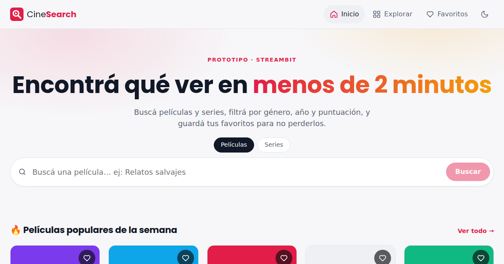

# 🎬 CineSearch

> Prototipo del nuevo motor de búsqueda de **StreamBit S.A.**: encontrá qué película o serie ver en menos de 2 minutos.



**🔗 Demo:** _agregá acá tu URL de Netlify_ · **📐 Planificación y wireframes:** [docs/PLANIFICACION.md](docs/PLANIFICACION.md)

## ✨ Funcionalidades

- 🔍 Búsqueda de **películas y series** por título
- 🎭 Filtros por **género**, **año de estreno** y **puntuación mínima** (guardados en la URL, se pueden compartir)
- 📄 **Detalle** con sinopsis, reparto, dirección y **tráiler** de YouTube
- ❤️ **Favoritos** persistidos en `localStorage`
- 🕘 **Historial** de búsquedas recientes
- 📑 **Paginado** de resultados
- 🌗 **Modo oscuro / claro**
- 📱 **Responsive** (mobile 375 px, tablet 768 px, desktop)
- ⏳ Estados de carga, error (con reintentar) y vacío

## 🛠️ Stack

| | |
|---|---|
| UI | React 19 + Vite |
| Routing | React Router |
| Estado global | Context API + custom hooks |
| Estilos | CSS puro con variables (sin frameworks) |
| Datos | [TMDb API](https://developer.themoviedb.org/) |
| Deploy | Netlify |

## 🚀 Cómo correrlo localmente

```bash
git clone https://github.com/ujeisson-alt/cinesearch.git
cd cinesearch
npm install
cp .env.example .env      # y pegá tu API Key de TMDb
npm run dev
```

Obtené tu clave gratis en **themoviedb.org → Configuración → API**. Sirve tanto la *API Key (v3)* como el *Read Access Token (v4)*.

## 📁 Estructura

```
src/
├── components/   Header, SearchBar, MovieCard, MovieGrid, GenreFilter, Filters,
│                 Pagination, LoadingSpinner, ErrorMessage, EmptyState, Footer
├── pages/        HomePage, ResultsPage, MovieDetailPage, FavoritesPage, NotFoundPage
├── hooks/        useMovies, useFetch, useGenres, useLocalStorage, useTheme
├── context/      FavoritesContext, HistoryContext
├── services/     tmdb.js  (todas las llamadas a la API)
└── styles/       variables.css (guía de estilos), global.css
```

## ☁️ Deploy en Netlify

1. *Add new site → Import from GitHub* y elegí el repo `cinesearch` (rama `main`).
2. Build command: `npm run build` · Publish directory: `dist` (ya configurado en `netlify.toml`).
3. *Site settings → Environment variables*: agregá `VITE_TMDB_API_KEY`.
4. Cada `push` a `main` dispara un deploy automático.

## 👤 Autor

**Jeisson Uribe** · [LinkedIn](https://www.linkedin.com/in/jeisson-uribe-qa-data) · [GitHub](https://github.com/ujeisson-alt)

---

<sub>Este producto usa la API de TMDb pero no está respaldado ni certificado por TMDb.</sub>
